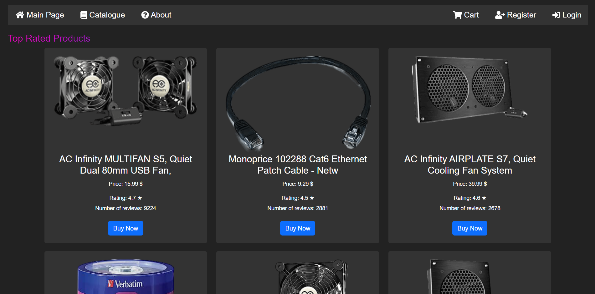

# webShopWithDjango

webShopWithDjango is a full-featured online electronics store that allows users to browse, select, and purchase electronic products. The project includes user authentication, category, and product management, shopping cart functionality, order processing, and an administrative interface to manage all aspects of the store.

## Project Screenshots

*Screenshot of the Home Page*

*Screenshot of a Catalogue Page*

*Screenshot of the Cart Page*

*Screenshot of the Registration Page*

## Table of Contents

- [Data Collection for the webShopWithDjango](#data-collection-for-the-webShopWithDjango)
- [Features](#features)
- [Functional Requirements](#functional-requirements)
- [Technical Requirements](#technical-requirements)
- [Installation](#installation)
- [Usage](#usage)
- [Contributing](#contributing)
- [License](#license)

## Data Collection for the webShopWithDjango

In the development of my webShopWithDjango project, i gathered product data from Amazon by utilizing various user agents. This data acquisition process allowed us to extract essential information about the products available on Amazon's platform.

### 1. Web Scraping with User Agents

To prevent Amazon's anti-scraping measures and enhance my data collection capabilities, i employed a rotation of user agents for each scraping session. By using different user agents, i emulated various web browsers and devices, making our scraping activities appear more natural and less detectable.

The Python `requests` library was instrumental in sending HTTP requests to Amazon's product pages. I leveraged the `BeautifulSoup` library to parse the HTML content and extract specific product details like the title, price, rating, and number of reviews. My custom functions, such as `get_title()`, `get_price()`, `get_rating()`, and `get_review_count()`, facilitated the extraction of these data points from the product pages.

### 2. Background Removal with remove.bg API

Once i obtained the product images from Amazon, i aimed to enhance the visual appeal of our online store by removing the background from these images. For this purpose, i integrated the `remove.bg` API into our data pipeline. The `remove.bg` API is a powerful tool that automatically removes backgrounds from images, resulting in clean and professional-looking product images.

By leveraging the `remove.bg` API, i transformed the product images, ensuring that only the main product item remained, and any irrelevant or distracting backgrounds were removed. The seamless integration of this feature enhanced the overall aesthetics and consistency of our online store's product display.

### 3. Data Integration into the Database

In summary, my data collection pipeline involved web scraping with rotating user agents to obtain product information from Amazon, followed by background removal using the remove.bg API to enhance the product images. The resultant data was seamlessly integrated into our database, ensuring that my webShopWitjDjango offers an engaging and visually appealing shopping experience to its users.

## Features

- User registration and authentication using Django's Authentication Framework.
- Browse a list of categories and view products within each category.
- Search products by various parameters such as category and price range.
- Add products to the shopping cart and manage the cart contents.
- The qr code must be scanned in order to pay.
- Administrative interface for adding/editing/deleting categories, products, managing orders, and users.

## Functional Requirements

1. Django's Authentication Framework for user registration and login.
2. Category and product management system.
3. Search functionality to allow users to find products by different parameters.
4. Shopping cart implementation to manage selected items before checkout.
5. Checkout process to finalize orders and collect delivery and payment information.
6. Administrative interface to manage the online store and its contents.

## Technical Requirements

1. Python and Django Framework for backend development.
2. Django ORM and PostgreSQL for data storage (categories, products, orders, users).
3. Version control using Git.

## Installation

1. Clone the repository: `https://github.com/Yoniqueeml/webShopWithDjango`
2. Navigate to the project directory: `cd ElectroShop`
3. Navgiate to the app directory: 'cd webApp'
4. Run the Django development server: `python manage.py runserver`

## Usage

1. Access the webShopWithDjango web application by visiting `http://localhost:8000/` in your web browser.
2. Browse different categories and products, search for specific items.
3. Register or log in as a user to add products to the cart and proceed to checkout.
4. Access the administrative interface at `http://localhost:8000/admin` to manage the store's content.

## Contributing

I welcome contributions from the community. If you find any issues or have new ideas, feel free to submit a pull request or open an issue.

## License

This project is licensed under the [MIT License](LICENSE).
